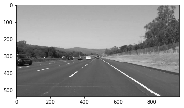
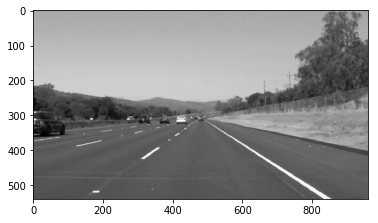
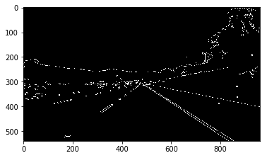
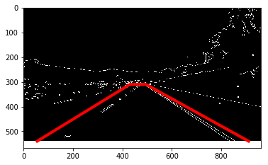
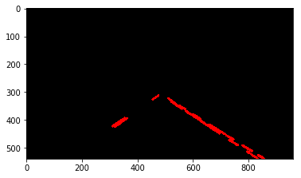
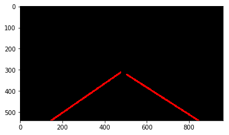
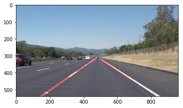

# **Finding Lane Lines on the Road** 

Goals
---

The goals / steps of this project are the following:
* Make a pipeline that finds lane lines on the road
* Reflect on your work in a written report

[project_results]: ./examples/readme_solid_white_right.jpg "input and output"
[grayed]: ./examples/solidWhiteRight/grayed.png "grayed"
[blurred]: ./examples/solidWhiteRight/blurred.png "blurred"
[canny]: ./examples/solidWhiteRight/canny.png "canny"
[masked]: ./examples/solidWhiteRight/masked.png "masked"
[segmented_lines]: ./examples/solidWhiteRight/segmented_line.png "segmented lines"
[solid_line]: ./examples/solidWhiteRight/solid_line.png "solid line"
[weighted_image]: ./examples/solidWhiteRight/weigthed.png "weighted image"

![input and output][project_results]

---

### Reflection

### 1. Pipeline Description

Following table summarizes the pipeline implement lane detection in images and videos

<table>
    <tr>
        <th width="10%">Function</th>
        <th width="50%">Description</th>
        <th>Preview</th>
    </tr>
    <tr>
        <td>Grayscale</td>
        <td>Convert RGB image to grayscale image to help detect lines from the intesity or brightness of lines</td>
        <td></td>
    </tr>
    <tr>
        <td>Gaussian Blur</td>
        <td>Apply Gaussian blur or kernel (filter) to smooth the image in order to remove the noise</td>
        <td></td>
    </tr>
    <tr>
        <td>Canny Edge Detection</td>
        <td>Apply canny edge detection on the blurred gray image to detect edges based on the intensity gradients in the image</td>
        <td></td>
    </tr>
    <tr>
        <td>Region of Interest</td>
        <td>Identify region of interest in the image to detect the lane lines and mask the rest. The vertices of the masks are hard-coded based on best possible part of image to identify the lines. Used four-sided polygon instead of a triangle.</td>
        <td></td>
    </tr>
    <tr>
        <td>Hough Transformation</td>
        <td>Apply Hough transformation to detect the straight lines in the image within the region of interest. Hough transformation finds most prominent lines based on a voting procedure carried out in parameter space formed by the edges detected.</td>
        <td></td>
    </tr>
    <tr>
        <td>Draw lines - Extrapolation off</td>
        <td>
            There is an extrapolation flag in the pipeline parameters which can be enabled or disabled. When disabled, extrapolation is not performed and segmented lines are drawn on the image inplace.
        </td>
        <td></td>
    </tr>
    <tr>
        <td>Draw lines - Extrapolation on</td>
        <td>
            This function extrapolates the solid straight line from a given set of points.
            <li>Isolate left and right lines from the detected lines based on sign of the slope i.e. negative (right) or positive (left) </li>
            <li>Ignore vertical lines and slopes that falls outside of threshold. Slope threshold is a tuning parameter which is set of lower and upper boundary. In this case, it is set to [0.45, 1] after various trial and errors.</li>
            <li>For each set of left and right lines, determine the best fitting single solid straight line similar to linear regression.</li>
            <li>From the best fit line, determine end points of the line and draw lines on the image inplace.</li>
        </td>
        <td></td>
    </tr>
    <tr>
        <td>Save Results</td>
        <td>
            Combine detected lines along with original image and return results.
        </td>
        <td></td>
    </tr>
</table>

### 2. Potential Shortcomings

- Majority of the time was spent in tuning the pipeline parameters such as hough transform parameters, line thresholds, region of interest vertices etc. This was done based on the test images provided. If there are new images with lines in different colors or different road situations, the code may not function accurately.

- Pipeline does not work correctly when curved lines are present in the images or when shadow appears as in the optional challenge.

### 3. Possible Improvements

- Detecting region of interest from the image dynamically from the extrapolated lines. Instead of detecting lines within a single mask, detect best fit lines from different masked regions and then pick the best. Another idea is to train a neural network on a larger set of images and find parameters to identify vertices based on quality of input image.

- The lines detected in the video are not smooth and they are jittery. Based on suggestions from the slack channel, this can be removed using a low pass filter by comparing with lines detected in the previous frame.

- Another improvement could be building a better grid search to identify tuning parameters dynamically.

My expectation is that by the end of class, there must be better ways to detect lines in an image or video. Overall, project was not as intimidating as I thought it would be in the beginning.
